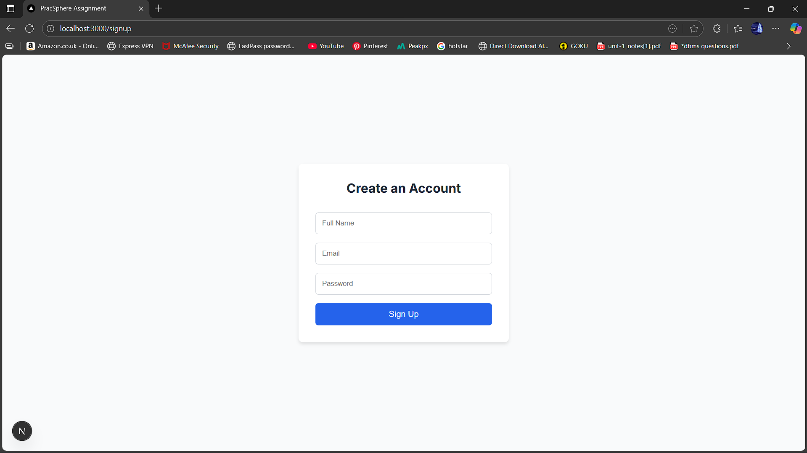
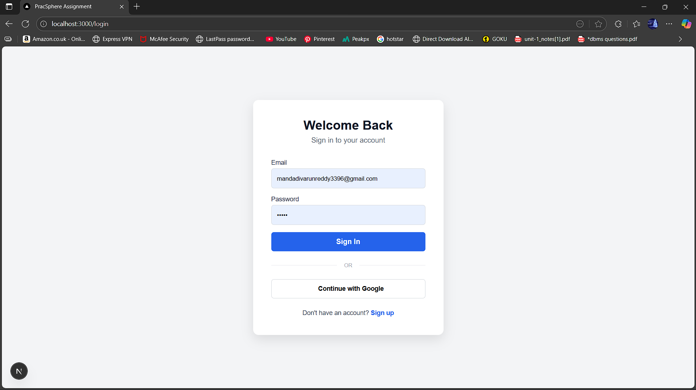
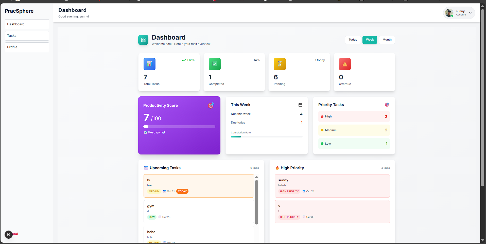
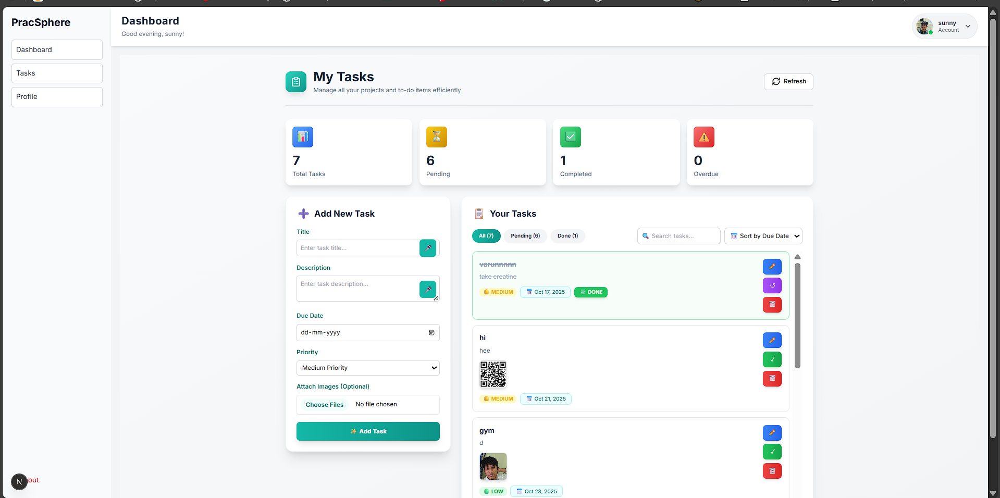
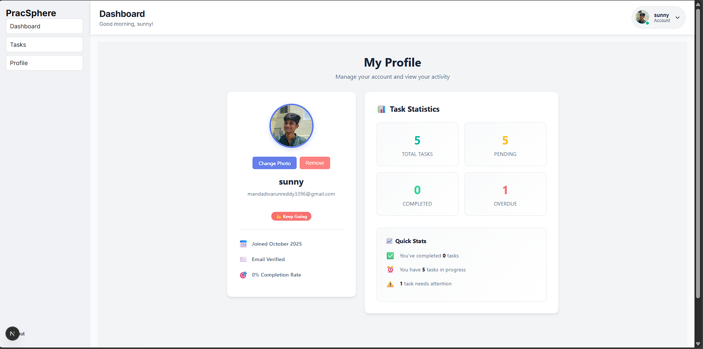

# PracSphere - Internship Assignment

This is my submission for the Student Developer Assignment Test from Shel-B Technologies Private Limited. The project is a secure Task Manager Dashboard built as a TurboRepo monorepo using pnpm workspaces.

It is built using the required modern tech stack: Next.js 15 (App Router), NextAuth, MongoDB, and Tailwind CSS.

## ✨ Features

* **Secure Authentication**: Implemented user signup and login pages using NextAuth.js with a Credentials Provider. All dashboard routes are protected and accessible only after a successful login.

* **Monorepo Architecture**: The project follows the required TurboRepo + pnpm structure, separating the Next.js `web` app from shared `ui` and `config` packages.

* **Responsive Dashboard Layout**: A clean, responsive layout featuring the required Sidebar (with links to Dashboard, Tasks, Profile, and Logout) and a persistent Topbar.

* **Full Task Management (CRUD)**: Logged-in users can manage their own personal tasks. This includes:

   * **Create**: Adding new tasks with a title, description, and due date.

   * **Read**: Viewing all tasks in a card or table format.

   * **Update**: Marking tasks as "complete" or "pending".

   * **Delete**: Removing tasks from the list.

* **Task Filtering**: The interface includes functionality to filter tasks by their status (All, Completed, or Pending).

* **Secure Database**: Uses MongoDB with separate `users` and `tasks` collections. Passwords are securely hashed using `bcrypt`, and all task operations are scoped to the logged-in user.

## 🚀 Local Setup and Installation

Follow these steps to get the project running on your local machine.

### Clone the Repository

```bash
git clone https://github.com/varun339658/pracsphere-assignment
cd pracsphere-assignment
```

### Install Dependencies

This project uses pnpm as the package manager.

```bash
pnpm install
```

### Set Up Environment Variables

Create a new file named `.env` in the root of the project. Copy the contents from `.env.example` and fill in your actual MongoDB URI and a new, random string for `NEXTAUTH_SECRET`.

### Run the Development Server

```bash
pnpm run dev
```

The application will now be available at http://localhost:3000.

## 🖥️ Screenshots

### Authentication Flow

<table>
  <tr>
    <td width="50%">
      
      <p align="center"><strong>User Registration</strong><br/>Clean signup interface with real-time validation</p>
    </td>
    <td width="50%">
      
      <p align="center"><strong>Secure Login</strong><br/>Email/password and Google OAuth options</p>
    </td>
  </tr>
</table>

### Task Management

<table>
  <tr>
    <td width="50%">
      
      <p align="center"><strong>Dashboard View</strong><br/>Comprehensive task overview with sidebar navigation</p>
    </td>
    <td width="50%">
      
      <p align="center"><strong>Task Creation</strong><br/>Modal form with priority and due date selection</p>
    </td>
  </tr>
</table>

### User Profile

<table>
  <tr>
    <td align="center">
      
      <p><strong>Profile Management</strong><br/>Customizable user profile with avatar upload</p>
    </td>
  </tr>
</table>
